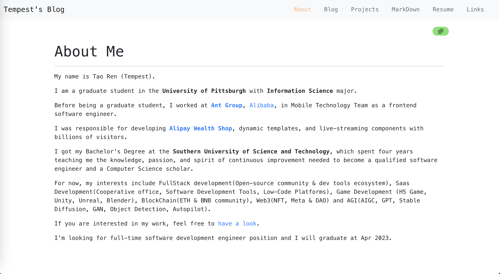

# Concise MarkDown Blog

[![PayPal][badge_paypal_donate]][paypal-donations]

<a href="https://www.buymeacoffee.com/tempes666" target="_blank"></a>



Build your own blog in 5 minutes with Markdown. No server needed. Free hosting.

## ✨ Features

- 📝 **Write in Markdown** - Focus on content, not code
- 🎨 **Customizable Themes** - Light/dark mode with color presets
- ⚙️ **TUI Setup Wizard** - Interactive CLI for quick configuration
- 🖥️ **GUI Config Editor** - Visual editor for settings (local only)
- 🚀 **One-Click Deploy** - Deploy to GitHub Pages or Vercel instantly
- 📱 **Mobile Responsive** - Works on all devices
- 🆓 **Completely Free** - No hosting costs

## 🚀 Quick Start

### 1. Create Your Blog

**Option A: Use Template Branch (Recommended)**

Clone the `template` branch which comes with clean tutorial content instead of personal blog posts:

```bash
git clone -b template https://github.com/623059008/ConciseMarkDownBlog.git my-blog
cd my-blog
git checkout -b main
git push -u origin main
```

**Option B: Clone Main**

```bash
git clone https://github.com/623059008/ConciseMarkDownBlog.git my-blog
cd my-blog
```

### 2. Configure

**Interactive Setup (Recommended):**

```bash
npm install
npm run setup
```

**Or use GUI Editor:**

```bash
npm start
# Open http://localhost:3000/?page=config
```

**Or edit manually:** [`src/config.js`](./src/config.js)

### 3. Add Content

Create markdown files in [`src/articles/`](./src/articles/):

```bash
echo "# Hello World\n\nMy first post!" > src/articles/Hello.md
```

Update `headers` in config to add navigation.

### 4. Deploy

**GitHub Pages (Free):**

```bash
git add .
git commit -m "Initial blog setup"
git push
```

Then enable Pages in repository Settings → Pages → Deploy from branch `gh-pages`.

**Vercel (Easier):**

[](https://vercel.com/new/clone?repository-url=https%3A%2F%2Fgithub.com%2F623059008%2FConciseMarkDownBlog)

See [Deployment Guide](doc/deployment.md) for detailed instructions.

## 📚 Documentation

| Topic | Description |
|-------|-------------|
| [Configuration](doc/configuration.md) | Complete config reference, navigation setup, themes |
| [Deployment](doc/deployment.md) | GitHub Pages and Vercel deployment guides |
| [Updating Content](doc/updating-content.md) | Add and edit blog posts |
| [Editor Guide](doc/editor.md) | Built-in markdown editor features |
| [Tech Stack](doc/tech-stack.md) | Architecture and technologies used |

## 🛠️ Development

```bash
# Install dependencies
npm install

# Start development server
npm start

# Build for production
npm run build

# Run tests
npm test
npm run test:e2e
```

## 🎯 Why This Blog?

- **No Server Required** - Static site, host anywhere for free
- **Easy Updates** - Write Markdown, git push, done
- **Full Control** - Own your content, custom domain support
- **Developer Friendly** - React-based, easily extensible
- **Notion Compatible** - Export Notion docs as Markdown

## 🙋 Support

- ⭐ Star this repository
- 🐛 [Report issues](https://github.com/tempest2023/ConciseMarkDownBlog/issues)
- 💡 [Request features](https://github.com/tempest2023/ConciseMarkDownBlog/issues)
- ☕ [Buy me a coffee](https://www.buymeacoffee.com/tempes666)

## 📜 License

[MIT](LICENSE) © [Tempest](https://tempest.fun/)

[badge_paypal_donate]: https://ionicabizau.github.io/badges/paypal_donate.svg
[paypal-donations]: https://www.paypal.com/paypalme/TaoTempest
